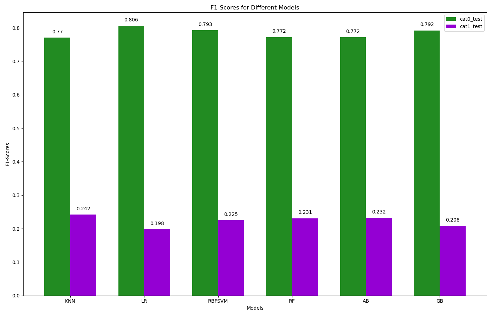

# Dynamic Propensity Prediction in Supercooled Water

In this introductory project on machine learning models, we aim to determine the dynamic propensity (DP)[1] of a supercooled water system based solely on initial structural parameters (V4[2], V4S[3], LSI[4], $\zeta$[5]). While traditional machine learning algorithms are typically inadequate for making accurate predictions in this context, this project explores the potential of these algorithms.

## Introduction

Despite decades of theoretical studies, the nature of the glass transition remains elusive and debated. The existence of structural predictors of its dynamics is a major open question. 

## Methodology

Our goal is to predict the dynamic propensity (DP) at 210 K on a system of 10000 TIP4P-2005 water molecules at t* (when the non-Gaussian parameter is maximal[6]). Molecular Dynamics where performed using GROMACS.

    Data Preparation:
        Calculated DP for all molecules.
        Assigned a value of 1 to the 20% of molecules with the highest DP values and 0 to the remaining 80%.
        Calculated the structure parameters on the real dynamic (RD) and on the inherent structe (IS), where the energy fluctuations had been removed.
        Used the Synthetic Minority Oversampling Technique (SMOTE) to address data imbalance.

    Machine Learning Models:
        Logistic Regression: A baseline linear model to classify the data.
        Nearest Neighbors: A non-linear model considering proximity for classification.
        Radial Basis Function Support Vector Machine (RBF SVM): A powerful kernel-based method for non-linear classification.
        Random Forest: An ensemble method using multiple decision trees to improve prediction accuracy.
        AdaBoost Classifier: An ensemble method that combines weak classifiers to form a strong classifier.
        Gradient Boosting Classifier: An advanced boosting method that builds models sequentially to correct errors of previous models.
        
## Results

As mentioned before, traditional machine learning algorithms are not capable of making good predictions of DP from initial structural parameters.

## Repository Structure

    data.csv: Contains the dataset.
    Results.csv: Output files including model performance metrics.
    Pipeline.py: Script for data preprocessing, model training, and evaluation.
    Graph.py: Script for generating visualizations from the results.
    README.md: Project overview.

## References

1. A. Widmer-Cooper, P. Harrowell, H. Fynewever, “How Reproducible Are Dynamic Heterogeneities in a Supercooled Liquid?,” Phys. Rev. Lett. 93, 135701 (2004).
2. J. M. Montes de Oca, F. Sciortino and G. A. Appignanesi, “A structural indicator for water built upon potential energy considerations,” J. Chem. Phys. 152, 244503 (2020).
3. N. A. Loubet , A. R. Verde , G. A. Appignanesi, “A water structure indicator suitable for generic contexts: two-liquid behavior at hydration and nanoconfinement conditions and a molecular approach to hydrophobicity and wetting,” J. Chem. Phys. 160, 144502 (2024).
4. G. A. Appignanesi, J. A. Rodriguez Fris, and F. Sciortino, “Evidence of a two-
state picture for supercooled water and its connections with glassy dynamics,” Eur.
Phys. J. E 29, 305–310 (2009).
5. J. Russo and H. Tanaka, “Understanding water’s anomalies with locally favoured
structures,” Nat. Commun. 5, 3556 (2014).
6. F. Sciortino et al., “Supercooled water and the kinetic glass transition,” Phys.Rev. E 54, 6331–6343 (1996).
